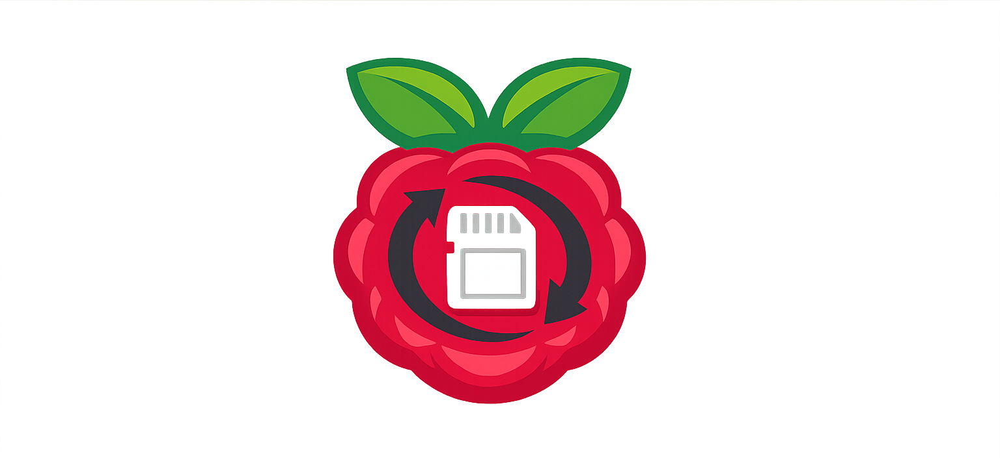

<p align="center">
  
</p>

<h1 align="center">AutoShrinkPi</h1>
<h3 align="center">Backup. Shrink. Expand. Done.</h3>

---

# 🇪🇸 Descripción (Español)

**AutoShrinkPi** es un sistema modular y automatizado para realizar:

- Backups completos de la SD y de la USB principal  
- Backups de una USB adicional sin detener Docker  
- Recorte (shrink) de imágenes `.img`  
- Preparación de imágenes con expansión automática al primer arranque  
- Compresión optimizada con `pigz`  
- Almacenamiento centralizado en un NAS  

El objetivo es disponer de copias de seguridad fiables, comprimidas, optimizadas y listas para restaurar con Balena Etcher.

---

# 🏗 Arquitectura del sistema

## 1. USB principal con `/opt/mydockers`
La Raspberry Pi utiliza una USB externa como almacenamiento principal para Docker:

```
/opt/mydockers
```

Esta unidad contiene contenedores, volúmenes y datos persistentes.  
Por seguridad, Docker debe detenerse antes de clonar esta unidad.

---

## 2. SD interna del sistema
Contiene:

- Sistema operativo  
- `/boot`  
- Partición raíz  

También se respalda con recorte automático.

---

## 3. NAS montado en `/mnt/nas`
Todas las imágenes generadas se almacenan en:

```
/mnt/nas
```

Ejemplo de `/etc/fstab`:

```
192.168.1.X:/backups /mnt/nas nfs defaults 0 0
```

---

# 📦 Scripts incluidos (v2.1)

| Script | Descripción |
|--------|-------------|
| `backup_usb_v2.1.sh` | Backup USB principal (detiene Docker) |
| `backup_sd_v2.1.sh` | Backup SD del sistema (detiene Docker) |
| `backup_usb_extra_v2.1.sh` | Backup USB adicional (NO detiene Docker) |
| `recortar_imagen_v2.1.sh` | Recorta una imagen `.img` existente |
| `recortar_y_expandir_v2.1.sh` | Recorta `.img` + expansión automática |
| `backup_master_v2.1.sh` | Menú principal para gestionar todo |

---

# 🧭 Flujo de trabajo típico

### Backup del sistema completo
```
./backup_master_v2.1.sh
→ Opción 1 (USB principal)
→ Opción 2 (SD)
```

### Backup de una USB externa
```
→ Opción 3
```

### Recortar una imagen existente
```
→ Opción 4
```

### Recortar + expansión automática
```
→ Opción 5
```

---

# 🖥 Diagrama de arquitectura

```
                ┌──────────────────────────────┐
                │        Raspberry Pi          │
                │                              │
                │  ┌──────────────┐            │
                │  │   SD Card    │────────────┼──► backup_sd_v2.1.sh
                │  └──────────────┘            │
                │                              │
                │  ┌──────────────┐            │
                │  │ USB (Docker) │────────────┼──► backup_usb_v2.1.sh
                │  └──────────────┘            │
                │                              │
                │  ┌──────────────┐            │
                │  │ Extra USB    │────────────┼──► backup_usb_extra_v2.1.sh
                │  └──────────────┘            │
                └────────────┬─────────────────┘
                             │
                             ▼
                ┌──────────────────────────────┐
                │             NAS              │
                │         /mnt/nas/backups     │
                └──────────────────────────────┘
```

---

# 📂 Estructura del proyecto

```
/scripts
    backup_master_v2.1.sh
    backup_usb_v2.1.sh
    backup_sd_v2.1.sh
    backup_usb_extra_v2.1.sh
    recortar_imagen_v2.1.sh
    recortar_y_expandir_v2.1.sh

/mnt/nas
    backups/
        backup-usb-*.img.gz
        backup-sd-*.img.gz
        backup-usb-extra-*.img.gz
```

---

# 🇬🇧 English Description

**AutoShrinkPi** is a modular and automated system for:

- Full backups of the SD card and primary USB drive  
- Backups of an additional USB drive without stopping Docker  
- Shrinking `.img` files  
- Preparing auto‑expandable images for first boot  
- Fast compression using `pigz`  
- Centralized storage on a NAS  

The goal is to produce reliable, optimized images ready to flash with Balena Etcher.

---

# 🏗 System Architecture

### 1. Primary USB drive (`/opt/mydockers`)
Used as Docker storage.  
Docker must be stopped before cloning this drive.

### 2. Internal SD card
Contains OS, `/boot`, and root filesystem.

### 3. NAS mounted at `/mnt/nas`
Stores all generated images.

---

# 📦 Included Scripts (v2.1)

| Script | Description |
|--------|-------------|
| `backup_usb_v2.1.sh` | Backup primary USB (stops Docker) |
| `backup_sd_v2.1.sh` | Backup SD card (stops Docker) |
| `backup_usb_extra_v2.1.sh` | Backup extra USB (does NOT stop Docker) |
| `recortar_imagen_v2.1.sh` | Shrink existing `.img` |
| `recortar_y_expandir_v2.1.sh` | Shrink `.img` + auto‑expand trigger |
| `backup_master_v2.1.sh` | Main menu script |

---

# 🧩 Project Structure

```
/scripts
    backup_master_v2.1.sh
    backup_usb_v2.1.sh
    backup_sd_v2.1.sh
    backup_usb_extra_v2.1.sh
    recortar_imagen_v2.1.sh
    recortar_y_expandir_v2.1.sh

/mnt/nas
    backups/
```

---

# 🏁 Licencia
Este proyecto puede utilizarse libremente para uso personal o profesional.

---

<p align="center"><strong>AutoShrinkPi</strong><br>Backup. Shrink. Expand. Done.</p>
